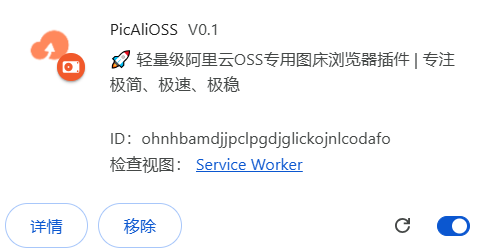
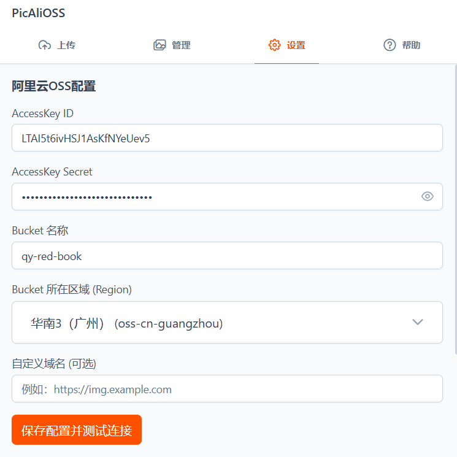
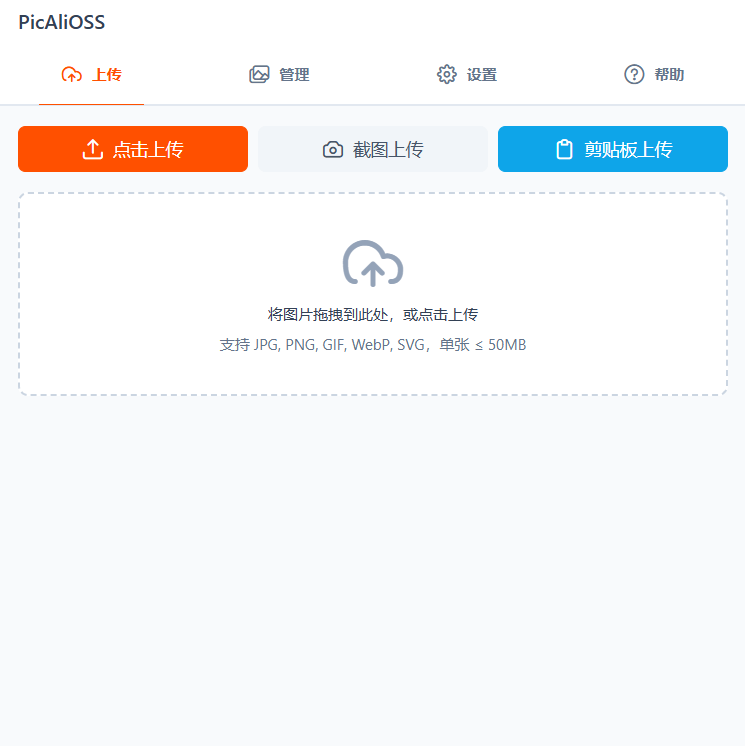
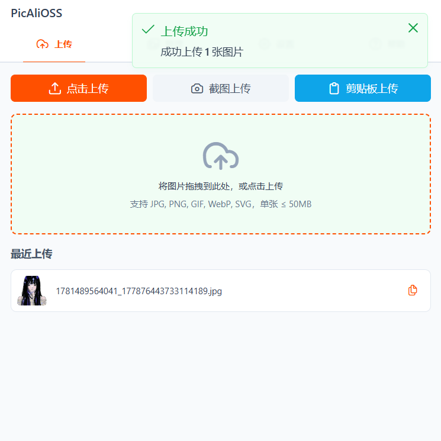
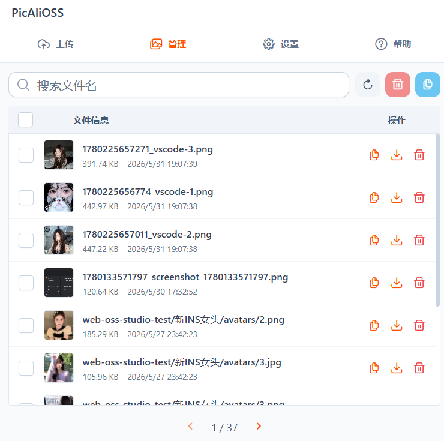
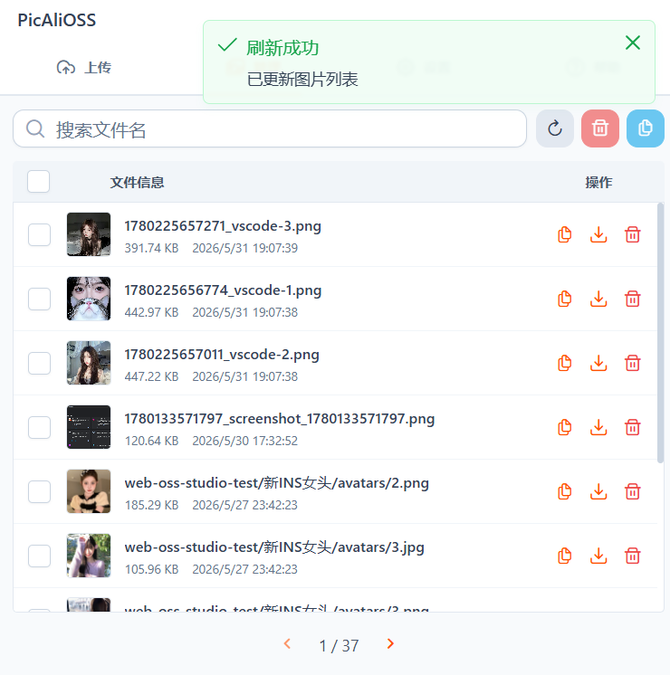
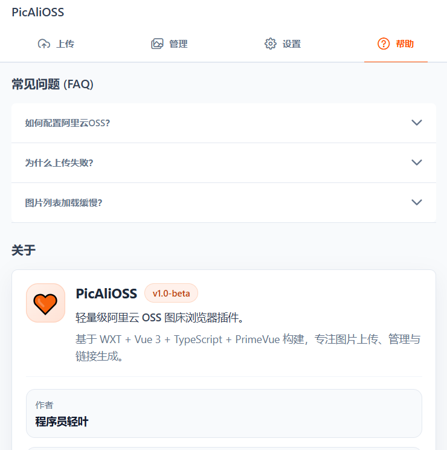

# ☁️ PicAliOSS

> **一款专业、轻量级的阿里云 OSS 图床浏览器插件，专注图片上传、云端管理与链接生成。**

[](https://opensource.org/licenses/MIT)
[](https://vuejs.org/)
[](https://wxt.dev/)

[**English**](./README.md) | [**中文说明**](./README.zh-CN.md)

---

## 🌟 项目简介

**PicAliOSS** 是一个基于前沿 Web 技术栈（`WXT` + `Vue 3` + `TypeScript` + `PrimeVue` + `Pinia`）构建的浏览器插件。它专为需要高频上传图片、管理 OSS 资源并快速分发外链的开发者、设计师与内容创作者量身定制。

项目坚持**纯前端架构**，所有阿里云 OSS 配置均安全地存储在本地浏览器侧，并通过 AES 加密处理敏感信息。无需任何中间自建后端服务，真正做到开箱即用，既保证了极佳的隐私安全性，也带来了极致的上传体验。

## ✨ 核心能力

- **🎯 阿里云 OSS 深度定制**：围绕 OSS 上传、管理与链接生成全链路深度优化。
- **🚀 全场景上传方式**：支持本地文件选择、拖拽上传、网页全屏截图上传以及剪贴板快捷上传。
- **🔗 一键外链分发**：无缝支持生成并复制 `URL`、`Markdown`、`HTML` 等常见格式链接。
- **🖼️ 全功能资源管理**：内置 OSS 文件浏览器，支持关键词搜索、图片预览、删除及高效批量操作。
- **⚙️ 丝滑配置体验**：提供直观的设置界面，支持 OSS 区域下拉快捷选择及实时的连接可用性测试。
- **🔒 本地安全加密**：敏感认证信息（如 AccessKey）仅保留在本地，配合加密处理，守护资产安全。
- **🛠️ 现代化工程体系**：深度集成 `Vitest`、`Husky`、`VitePress`，配备严格的类型检查与代码规范格式化脚本。

## 💻 技术栈

- **浏览器扩展框架**: `WXT`
- **前端核心**: `Vue 3` + `TypeScript`
- **状态管理**: `Pinia`
- **UI 组件库**: `PrimeVue` + `PrimeIcons`
- **云存储 SDK**: `ali-oss`
- **构建工具**: `Vite`
- **单元测试**: `Vitest`
- **文档构建**: `VitePress`
- **代码规范**: `Husky` + `oxlint` + `oxfmt`

## 🌐 浏览器支持

- ✅ **Chrome / Edge** 等主流 Chromium 内核浏览器
- ⚠️ **Firefox**（已提供构建链路，开发与生产环境建议实测验证）

## 🚀 快速开始

### 1. 克隆项目

```bash
git clone https://github.com/yxb123456cy/PicAliOSS.git
cd PicAliOSS
```

### 2. 安装依赖

强烈推荐使用 `bun` 以获得最佳的包安装体验：

```bash
bun install
```

### 3. 配置环境变量

复制 `.env.example` 并重命名为 `.env.local`，填入你的专属 OSS 配置：

```bash
cp .env.example .env.local
```

```env
VITE_ACCESSKEY_ID="你的_access_key_id"
VITE_ACCESSKEY_SECRET="你的_access_key_secret"
VITE_BUCKET="你的_bucket_名称"
VITE_REGION="你的_region"
VITE_APP_EMOJI_ICON="🧡"
VITE_APP_NAME="PicAliOSS"
VITE_APP_VERSION="v0.1"
VITE_APP_AUTHOR="程序员轻叶"
VITE_APP_DESCRIPTION="轻量级阿里云 OSS 图床浏览器插件。"
VITE_APP_BIO="基于 WXT + Vue 3 + TypeScript + PrimeVue 构建，专注图片上传、管理与链接生成。"
VITE_APP_REPOSITORY="https://github.com/yxb123456cy/PicAliOSS"
```

### 4. 启动本地开发

```bash
bun run dev
```

如需针对 Firefox 进行开发构建：

```bash
bun run dev:firefox
```

*提示：启动成功后，请在浏览器的扩展管理页中以“开发者模式”加载生成的 `.output/` 目录。*

### 5. 构建与打包

```bash
bun run build
bun run zip
```

## 🛠️ 常用开发命令

```bash
bun run dev            # 启动 Chrome/Chromium 开发服务
bun run dev:firefox    # 启动 Firefox 开发服务
bun run build          # 构建 Chrome/Chromium 产物
bun run build:firefox  # 构建 Firefox 产物
bun run zip            # 生成发布版压缩包 (.zip)
bun run test:unit      # 运行 Vitest 单元测试
bun run typecheck      # 执行 TypeScript 类型检查
bun run lint           # 执行代码规范检查
bun run format:check   # 执行代码格式验证
```

## 📖 使用指南

### 1. 配置 OSS 参数
进入插件的 **设置 (Settings)** 页面，依次填写：
- `AccessKey ID`
- `AccessKey Secret`
- `Bucket`
- `Region`
- 自定义域名（可选）

*小技巧：配置完成后，点击“测试连接”按钮以确保参数无误。*

### 2. 上传图片
- **点击上传**：从本地文件系统中选择目标图片。
- **拖拽上传**：直接将图片拖入插件的指定区域。
- **截图上传**：一键截取当前网页并自动完成上传。
- **剪贴板上传**：直接读取系统剪贴板中的图片并极速上传。

### 3. 管理图片资产
- 在 OSS 文件列表中快速搜索历史上传的图片。
- 智能过滤非图片对象，保持面板清爽。
- 支持单图预览、一键复制外链、直接下载到本地或永久删除。
- 借助批量操作功能，大幅提升图床维护效率。

## 📸 界面预览

### 插件安装


### OSS 配置


### 上传入口


### 上传成功


### 图片管理


### 列表刷新


### 帮助页面


## 📁 项目结构

```text
PicAliOSS/
├── src/                    # 📦 核心业务源码
│   ├── entrypoints/        # 插件入口：popup / background / content
│   │   └── popup/          # 弹窗 UI：页面视图、路由与状态管理
│   ├── utils/              # 通用工具：OSS 封装、加密算法、链接处理等
│   ├── tests/              # 单元测试用例
│   └── assets/             # 全局样式、主题变量及静态图片
├── public/                 # 🖼️ 扩展图标及公共静态资源
├── docs/                   # 📚 VitePress 文档源码
├── screenshots/            # 📸 插件界面截图预览
├── .husky/                 # 🐶 Git Hooks 配置
├── .env.example            # 🔐 环境变量示例模板
├── package.json            # 📦 项目依赖与 NPM 脚本
└── wxt.config.ts           # ⚙️ WXT 核心框架及 Manifest 配置
```

## 🗺️ 未来规划 (Roadmap)

- [ ] 进阶上传支持：大文件直传、分片上传机制与断点续传能力。
- [ ] 扩展功能增强：网页内图片右键菜单快捷上传、多语言国际化 (i18n) 以及丰富的多主题切换。
- [ ] 持续集成部署：引入 GitHub Actions，实现自动化打包及跨浏览器的自动发布流水线。
- [ ] 完善文档建设：持续更新并细化用户使用手册与开发者文档。

## 🤝 参与贡献

我们非常欢迎任何形式的贡献！
- 提交 **Issue** 反馈 Bug，或提出激动人心的新功能建议。
- 发起 **Pull Request** 帮助优化代码、补充文档或增加测试用例。
- ⭐️ 点亮 **Star** 支持本仓库，让更多人发现 PicAliOSS！

在提交代码前，建议您先在本地执行以下检查，确保符合代码规范：

```bash
bun run typecheck
bun run test:unit
```

## 📄 开源协议

本项目基于 [MIT License](./License) 协议开源。

## 🏠 仓库地址

- **GitHub**: [https://github.com/yxb123456cy/PicAliOSS](https://github.com/yxb123456cy/PicAliOSS)
